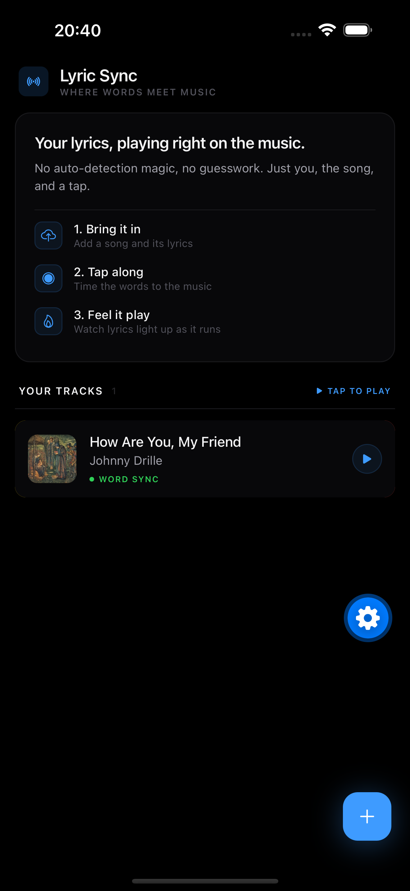
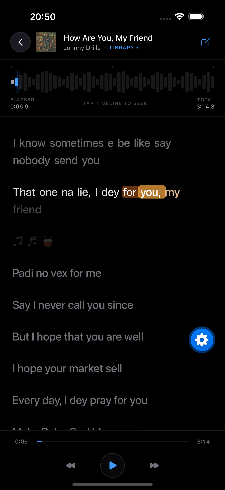
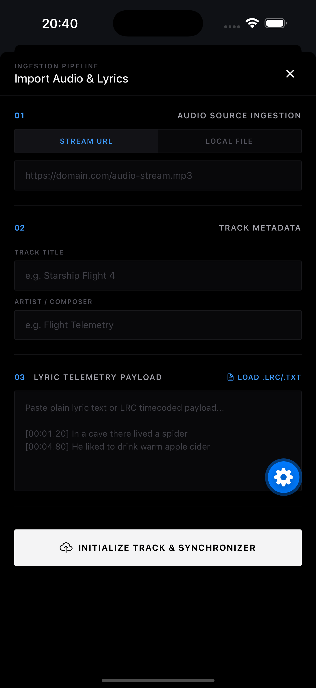
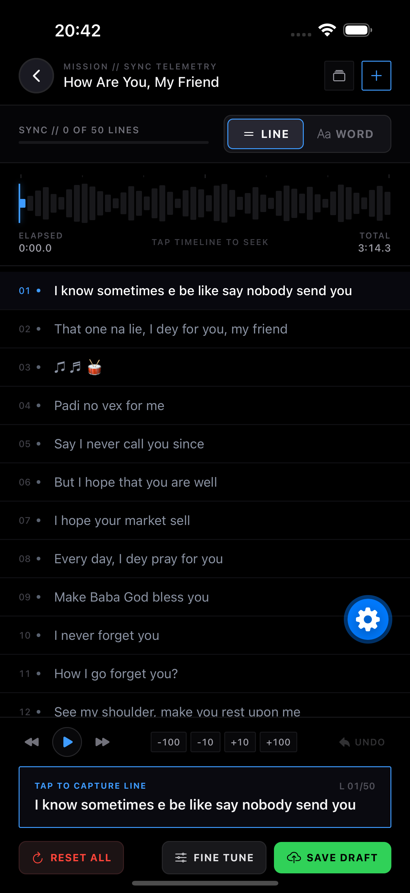
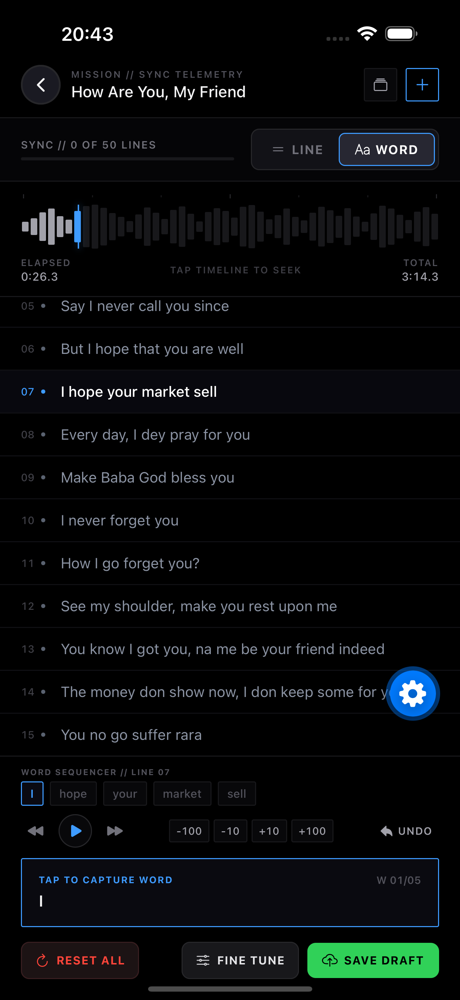
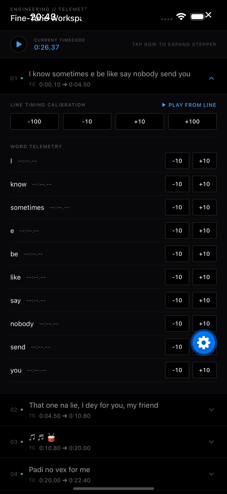

# Lyric Sync 🎵

*Inspired by the Spotify lyrics experience.*

A React Native app for creating and playing back **synchronized lyrics** — like karaoke, but you control the timing. Import any song, tap along to mark when each line starts, save your sync, and watch the lyrics scroll in real-time during playback.

Built with Expo SDK 57, TypeScript, and the React Native New Architecture.

### 📱 Try It Now!
Download the Android APK (EAS Preview Build):
**[Download Lyric Sync APK](https://expo.dev/artifacts/eas/8qj8zq-6r7H_h-eDJljKy988nQ2aKCaETpAtf9fSlOU.apk)**

## 📸 Screenshots

<p align="center">
  
  
  
</p>
<p align="center">
  
  
  
</p>

---

## Features

### 🎧 Listener Player
- **Real-time lyric scrolling** that highlights the active line as audio plays
- **Tap any line to seek** directly to that moment in the song
- **Tappable waveform** — tap anywhere on the waveform to jump to a position
- Transport controls: play/pause, skip ±5 seconds
- Progress bar with current/total time display

### ✏️ Sync Editor — "Tap-Along Recording"
- **One-tap sync workflow**: play the song, tap a big button each time the singer starts a new line
- **Line / Word mode toggle**: tap whole lines, or drill into word-level sync with tappable word chips
- **Word-level sync**: mark each word as it's sung; the last line only completes once its final word is captured
- **Three visual line states**: ✓ synced (green), ▶ active (cyan), · waiting (gray)
- **Instant feedback**: green flash overlay + haptic vibration on each mark
- **Undo**: reverts the last mark and rewinds audio 3 seconds for re-marking (pauses/seeks/resumes smoothly)
- **Per-line delay**: nudge any line's timing by ±10 / ±100 ms
- **Start Over**: clears all timestamps with confirmation (undoable)
- **Auto-finish**: last line's end time is set to the audio duration automatically
- **🎉 Celebration state**: collapsible "All Done!" banner when every line is synced
- **Progress indicator**: "Line 3 of 5 synced" with a fill bar

### 🛠️ Fine Tune Screen
- Open from the "All Done!" state for post-sync corrections
- **Per-line nudge** ±10 / ±100 ms and **per-word nudge** for boundary fixes
- **Listen to this line** to audition a single line's timing
- All edits stay in the undo history and can be saved

### 📤 LRC Export
- Export synced lyrics as an `.lrc` file (with optional word-level offline tags)
- Uses the native share sheet via `expo-sharing`

### 📂 Track Management
- **Import by URL**: paste an `.mp3` or `.m4a` link
- **Import from device**: pick audio files via the system file picker
- **Lyrics import**: paste plain text or pick a `.txt`/`.lrc` file (LRC timestamps are auto-parsed)
- **Track library**: browse, switch, and delete imported tracks
- **Persistent storage**: all tracks and sync data saved to SQLite

---

## Tech Stack

| Layer | Technology |
|-------|-----------|
| Framework | [Expo](https://expo.dev) SDK 57 + React Native 0.86 (New Architecture) |
| Language | TypeScript 6.0 |
| Routing | [Expo Router](https://docs.expo.dev/router/introduction/) (file-based) |
| State | [Zustand](https://zustand-demo.pmnd.rs/) |
| Audio | [expo-audio](https://docs.expo.dev/versions/latest/sdk/audio/) |
| Database | [expo-sqlite](https://docs.expo.dev/versions/latest/sdk/sqlite/) |
| File System | [expo-file-system](https://docs.expo.dev/versions/latest/sdk/filesystem/) |
| Sharing | [expo-sharing](https://docs.expo.dev/versions/latest/sdk/sharing/) |
| Haptics | [expo-haptics](https://docs.expo.dev/versions/latest/sdk/haptics/) |
| Validation | [Zod](https://zod.dev/) |
| Animations | React Native `Animated` API |
| Gestures | react-native-gesture-handler |

---

## Project Structure

```
src/
├── app/                          # Expo Router screens
│   ├── (tabs)/
│   │   ├── _layout.tsx           # Tab navigator (Listener / Editor)
│   │   ├── index.tsx             # Listener Player screen
│   │   └── editor.tsx            # Sync Editor screen
│   └── _layout.tsx               # Root layout
│
├── domain/                       # Pure business logic (no React)
│   ├── lyrics.ts                 # Zod schemas, types, binary search algorithms
│   └── timelineEngine.ts         # One-tap mark (line+word), undo/redo, reset,
│                                 # nudge/shift helpers, LRC parse & build
│
├── features/
│   ├── creator/
│   │   ├── components/
│   │   │   ├── SyncEditorView.tsx    # Main sync editor UI
│   │   │   ├── FineTuneScreen.tsx    # Post-sync per-line/word nudge screen
│   │   │   └── ImportTrackModal.tsx  # Track import form
│   │   └── services/
│   │       └── lrcExporter.ts        # Write + share .lrc files
│   │
│   ├── player/
│   │   ├── store/
│   │   │   └── usePlayerStore.ts    # Zustand global state
│   │   └── components/
│   │       └── TrackLibraryModal.tsx # Browse/switch/delete tracks
│   │
│   └── synchronization/
│       ├── components/
│       │   ├── AudioWaveform.tsx           # Tappable pseudo-amplitude waveform
│       │   ├── SynchronizedLyricsView.tsx  # Real-time lyric scroller
│       │   └── LyricWordItem.tsx           # Word-level display component
│       └── hooks/
│           └── useAudioSync.ts            # Audio clock sync hook
│
└── services/
    └── db.ts                     # SQLite database (init, CRUD, seed data)
```

---

## Getting Started

### Prerequisites

- Node.js 18+
- An Android device/emulator or iOS simulator
- [Expo Go](https://expo.dev/go) app (for quick testing) or an [Expo dev build](https://docs.expo.dev/develop/development-builds/introduction/)

### Install & Run

```bash
# Install dependencies
npm install

# Start the dev server
npx expo start
```

Scan the QR code with Expo Go, or press `a` for Android / `i` for iOS simulator.

### Default Track

The app ships with **"How Are You, My Friend"** by Johnny Drille as a pre-loaded track with unsynced lyrics. Open the **Sync Editor** tab, play the audio, and tap along to mark each line or word.

---

## How to Sync a Song

1. Go to the **Sync Editor** tab
2. Tap **▶ Play** to start the audio
3. When you hear the singer begin a line, tap the big **"TAP TO CAPTURE LINE"** button
4. The line turns green ✓ and the next line activates automatically
5. If you miss, tap **UNDO** — the audio rewinds smoothly so you can re-tap
6. After all lines are marked, tap **SAVE DRAFT** to persist your sync to the database
7. Switch to the **Listener Player** to see your lyrics scroll and highlight in real-time

### Word-level sync

1. After (or before) line sync, flip the toggle to **WORD** mode in the Sync Editor
2. Tap any line in the list — its words appear in the **Word Sequencer ribbon**
3. Tap the big capture button each time you hear a word; the chips fill green as you advance
4. When the line finishes, the editor automatically advances to the next line
5. Use the **Fine Tune** screen to nudge any line or word by ±10 / ±100 ms

---

## Performance Engineering & Optimization Log 🚀

*Documenting the real performance bottlenecks I ran into building this app, ranked from hardest architectural headaches down to subtle UI nuances, and exactly how I fixed each one.*

---

### Rank 1: ⭐⭐⭐⭐⭐ (Extreme) — Full UI Freezes & Memory Leaks from Reanimated Worklet Overload & Clock Loops

#### The Problem
A few seconds after pressing play on an unsynced track, the entire app would lock up. The waveform bars stopped moving, pressing pause took 5+ seconds to react (or didn't react at all), and the phone started heating up. It felt like a classic runaway memory leak that brought both the JS and UI threads to their knees.

#### Root Cause
Two huge architectural issues were happening under the hood:
1. **Hooks in Loops & Unbounded Worklet Creation**: In the lyrics list, every single word item (`LyricWordItem`) was executing `useAnimatedStyle` to interpolate flames, opacities, and scale transforms. Across a full song with 50 lines and 400+ words, React was mounting hundreds of active Reanimated worklets simultaneously—even for lines and words that had 0 timestamps and weren't even playing!
2. **Clock Loop Thrashing in `useAudioSync`**: The audio synchronization hook was listening to player status ticks every 50ms. On *every single tick*, a `useEffect` was canceling and restarting a `withTiming` animation loop on the shared value clock. This flooded the Reanimated runloop with thousands of canceled frames per second.

#### How I Fixed It
1. **Split Static vs. Dynamic Word Renderers**: Refactored `LyricWordItem` into a lightweight memoized shell. If `word.startMs === 0`, it renders a clean, static `<Text>` element with **0 worklets** spawned. Only words with active timestamps mount `SyncedLyricWordItem`.
2. **Stabilized the Audio Clock**: Reworked `useAudioSync` to smoothly interpolate the shared value against `currentTime` without ripping down and restarting the animation loop on every status tick.

#### The Result
Zero memory leaks, silky 60fps playback, and instant response when tapping play/pause.

---

### Rank 2: ⭐⭐⭐⭐ (High) — High-Frequency Tap Dropping & Memory Churn in Rapid Word Sync (5 Taps in 3s)

#### The Problem
When syncing fast songs where words come in rapid-fire succession (e.g. 5 taps in 3 seconds), the tap button felt laggy and sluggish. Taps were getting dropped, timestamps were drifting, and the UI stuttered as you tapped faster.

#### Root Cause
1. **Touch Responder Latency**: The capture button was using `TouchableOpacity`, which waits for gesture responder negotiation and only fires on touch release (`onPress`). That built-in 50–150ms delay made fast tapping feel sticky.
2. **$O(N)$ Object Deep-Cloning**: On every single tap, `markWordBoundary()` in `timelineEngine.ts` was doing `.map()` loops across the entire song to deep-clone every single line and word object. For 5 rapid taps, that generated thousands of ephemeral objects in JavaScript heap.
3. **Unbounded History Stack**: The undo stack was storing an infinite array of deep-cloned song states on every tap, triggering frequent garbage collection pauses.
4. **Synchronous Store Trashing**: Calling `usePlayerStore.setState({ lyrics })` on every tap caused parent screen subscribers to trigger unnecessary render passes.

#### How I Fixed It
1. **Instant Touch-Down Actuation (`Pressable` + `onPressIn`)**: Switched the capture actuator to `<Pressable onPressIn={...} hitSlop={8}>`. This fires the moment your finger touches the glass with **0ms latency**.
2. **$O(1)$ Shallow Updates in Timeline Engine**: Refactored `markWordBoundary` and `markLineBoundary` to shallow-copy only the active line and its word array (`[...currentLines]`).
3. **Circular Bounded Undo History**: Capped `history.past` depth to a maximum of 50 states (`MAX_HISTORY_DEPTH = 50`).
4. **Snappy Non-Blocking Feedback**: Switched haptics to `Haptics.ImpactFeedbackStyle.Light` (which doesn't queue up or stall the OS haptic engine) and trimmed the flash animation from 350ms to 200ms.

#### The Result
You can tap as fast as your fingers can move (even 10 taps in 2 seconds) with zero dropped events and crisp, instantaneous audio timestamping.

---

### Rank 3: ⭐⭐⭐ (Medium) — Inverted Swipe Action Panels & 800ms Delay on Swipe-to-Unsync

#### The Problem
Swiping right on a track card on the home screen to un-sync felt broken: the row would slide open, show an empty or red background, and take almost a second before finally popping up the native confirmation alert.

#### Root Cause
1. **Artificial Animation Delay**: The gesture handler in `SwipeableTrackRow` was animating the card 400px off-screen with a soft spring (`damping: 18, stiffness: 180`) and *only* calling `runOnJS(confirmReset)()` inside the `finished` callback. That introduced a noticeable 600–800ms delay before the native dialog appeared.
2. **Inverted Panel Layout**: The background panels in the flex row were inverted. Swiping right (`tx > 0`) uncovered the left side of the card where the Delete panel was sitting with opacity 0, while the Un-sync panel was sitting on the hidden right side.
3. **JS Thread Jitter from `useState` in Worklets**: The gesture was calling `runOnJS(setShowResetHint)` inside `onUpdate`, causing React state re-renders on the JS thread during smooth 60fps pan gestures.

#### How I Fixed It
1. **Immediate Native Action Trigger**: In `onEnd`, if the swipe threshold is crossed, we immediately fire `runOnJS(confirmReset)()` on finger release while simultaneously snapping the card back to resting position with a snappy Reanimated spring (`stiffness: 300`).
2. **Corrected Physical Panel Ordering**: Put the amber **UN-SYNC** panel on the left (uncovered when swiping right) and the red **DELETE** panel on the right (uncovered when swiping left).
3. **Pure UI-Thread Hint Badges**: Replaced all React state updates during drag with pure Reanimated worklet styles (`resetHintStyle` and `deleteHintStyle`).
4. **Threshold Haptic Tick**: Added a crisp tactile tick the instant the threshold is crossed so you know the action has engaged before letting go.

#### The Result
Swiping right smoothly reveals the amber UN-SYNC panel with a tactile click, and the native confirmation prompt appears instantly the moment you let go.

---

### Rank 4: ⭐⭐ (Moderate) — Sync Cursor Jumping Backwards on Skipped Lines

#### The Problem
If you didn't want to sync an instrumental break or wanted to skip ahead to line 5, the moment you tapped a word or hit undo, the editor would get confused and jump all the way back to line 1.

#### Root Cause
1. `markWordBoundary` was assuming that `lineIndex - 1` was always the preceding line that just finished, unconditionally setting its `endMs` even if that line was skipped and untouched (`startMs === 0`).
2. `handleUndo` was running `findNextUnsyncedLine(history.present)` starting from index 0 across the entire array, forcing the cursor backwards to earlier untouched lines.

#### How I Fixed It
1. **Safe Boundary Closing**: `markWordBoundary` now checks `if (prevLine.startMs > 0)` before closing a previous line's timestamp. Skipped lines remain untouched.
2. **Localized Step-Back Undo**: `handleUndo` now steps back locally (`activeWordIndex - 1` or previous line's last word) based on where you currently are, rather than rescanning the whole song from line 0.
3. **Strictly Forward Progression**: Selecting any line or word in the list anchors the editor at that position and progresses strictly forward (`wi + 1` $\rightarrow$ next line $\rightarrow$ `0`).

#### The Result
You can jump anywhere in the song, skip instrumental breaks, or sync lines out of order without the editor ever jumping backwards.

---

### Rank 5: ⭐ (Low) — Active Line Text Typography & Contrast in Line Sync

#### The Problem
During line-by-line playback, it was hard to tell which line was currently active because the text color was too similar to the inactive and dormant lines.

#### Root Cause
The active and inactive text styling used similar low-luminosity gray tones without distinct typographic weight separation.

#### How I Fixed It
1. Set the active line text to crisp, high-contrast pure white (`#FFFFFF`) with `fontWeight: '600'`.
2. Dimmed dormant/waiting lines to `#8B93A3` and synced background lines to `#A1A1AA`.
3. Added smooth color and opacity transitions between active, upcoming, and past lines.

#### The Result
The currently sung line instantly catches your eye with clean, readable hierarchy.

---

## Architecture

### Single Authoritative Clock
The native `expo-audio` player status is the **single source of truth** for time. No duplicate clocks, no estimated positions. All timestamps come from `status.currentTime`.

### Timeline Engine (Pure Functions)
All sync logic lives in `src/domain/timelineEngine.ts` as **pure functions** with no React dependency:
- `markLineBoundary()` — One-tap: sets current line's startMs, closes previous line's endMs, advances cursor
- `markWordBoundary()` — Word-level capture: sets word's startMs, closes the previous word/line, anchors line startMs
- `finishLastLine()` / `finishLastWord()` — Auto-close the final line/word's endMs to the audio duration
- `shiftLineTimestamp()` / `shiftWordTimestamp()` — Nudge a whole line (incl. words) or a single word by ±ms
- `nudgeLineTimestamp()` / `nudgeWordTimestamp()` — Field-level micro-adjustments
- `undoSyncAction()` / `redoSyncAction()` — Bounded immutable history stack
- `resetAllTimestamps()` — "Start Over" (undoable)
- `parseLyricsDocument()` — Handles plain text and LRC format
- `buildLrcText()` — Serializes synced lines to standard `.lrc` text

### State Management
- **Zustand** (`usePlayerStore`) for global state: active track, lyrics, playback position
- **React `useState`** for local editor state: history stack, active line index

### Database
SQLite via `expo-sqlite` with three tables:
- `tracks` — Song metadata (title, artist, audio URI, sync status)
- `lyric_lines` — Line text + timestamps (foreign key to tracks)
- `lyric_words` — Word text + timestamps (foreign key to lyric_lines)

---

## Future Roadmap

- [x] **Fine Tune screen** — Word-level sync + nudge ±100ms per line/word
- [x] **LRC export** — Export synced lyrics as `.lrc` files
- [x] **Waveform seeking** — Tap the waveform to jump to a position
- [ ] **Real audio waveform** — Replace pseudo bars with actual amplitude data
- [ ] **Batch import** — Import multiple tracks at once

---

## License

MIT
